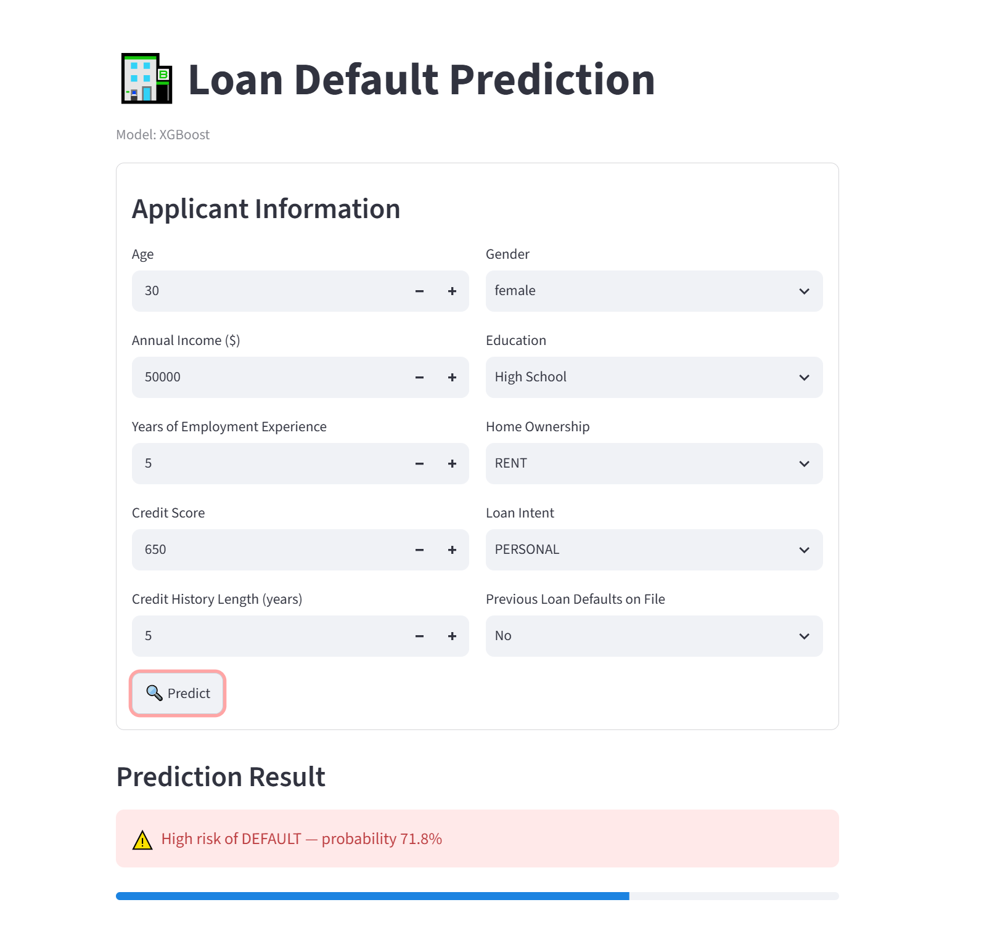
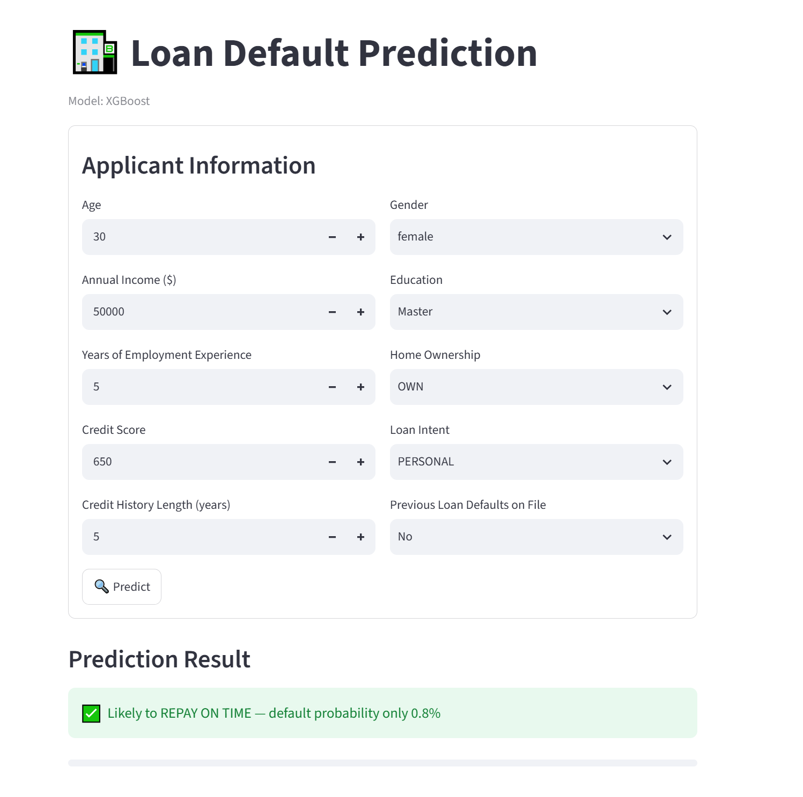

# 🏦 Loan Default Prediction

[](https://bankloan-default-prediction-cyc3udhusr7tr57pc8wnfq.streamlit.app)

**Binary classification model predicting whether a customer will default on a loan, using only pre-application customer attributes.**

> Part of a 5-model series on the same dataset (`loan_data.csv`), each answering a different business question. This repo covers **loan default prediction** only. A combined README comparing all 5 models will be published separately once every model is completed.

**Dataset:** [Bank Loan Data — Kaggle](https://www.kaggle.com/datasets/udaymalviya/bank-loan-data) — 45,000 records, 14 columns

| Item | Detail |
|------|--------|
| **Target** | `loan_status` (0 = repaid, 1 = default) |
| **Problem type** | Binary Classification |
| **Class balance** | 77.78% repaid / 22.22% default (imbalanced) |
| **Models** | Logistic Regression (baseline) → Random Forest → XGBoost |
| **Imbalance handling** | `class_weight='balanced'` (Logistic Regression, Random Forest), `scale_pos_weight` (XGBoost) |
| **Stack** | Python, Pandas, Scikit-learn, XGBoost, Matplotlib, Seaborn, Tableau |

---

## 📁 Repository Structure

```
loan-default-prediction/
│
├── model2_loan_default_prediction.ipynb          # Main notebook — clean (no outputs)
├── model2_loan_default_prediction_results.ipynb  # Notebook with all outputs & charts
├── model2_loan_default_prediction.py             # Standalone Python script
├── loan_data.csv                                 # Dataset (45,000 rows)
├── requirements.txt
├── .gitignore
└── README.md
```

---

## 🔁 ML Pipeline

```
Raw Data (CSV)
    │
    ▼
1. Data Loading & Inspection
   └── Target distribution check: 77.78% repaid / 22.22% default
    │
    ▼
2. Preprocessing
   ├── Drop leakage (loan_int_rate, loan_percent_income, loan_amnt)
   ├── Impute missing values (median) — no missing values found
   └── One-hot encode 5 categorical columns (done ONCE only)
    │
    ▼
3. Feature Engineering
   ├── Income_per_Emp_Year = person_income / (person_emp_exp + 1)
   └── Credit_History_per_Age = cb_person_cred_hist_length / (person_age + 1)
    │
    ▼
4. Stratified Train-Test Split (80/20, random_state=42)
   ├── Training set: 36,000 rows (77.78% / 22.22%)
   └── Test set    :  9,000 rows (77.78% / 22.22% — same ratio preserved)
    │
    ▼
5. StandardScaler — fit on TRAIN only, transform TEST separately
    │
    ▼
6. Model Training & Evaluation (imbalance-aware)
   ├── Logistic Regression (class_weight='balanced')
   ├── Random Forest (class_weight='balanced')
   └── XGBoost (scale_pos_weight=3.5)
    │
    ▼
7. Feature Importance (from Random Forest)
    │
    ▼
8. Tableau Export (test-set rows only — 9,000 rows)
```

---

## 📊 Results

### Target Variable — `loan_status`

| Class | Count | % |
|-------|-------|---|
| 0 — Repaid | 35,000 | 77.78% |
| 1 — Default | 10,000 | 22.22% |

### Test Set Performance (9,000 rows)

| Model | Accuracy | Precision | Recall | F1 | AUC-ROC |
|-------|----------|-----------|--------|-----|---------|
| Logistic Regression | 0.8038 | 0.5328 | 0.9515 | 0.6831 | 0.9154 |
| Random Forest | 0.8539 | 0.7060 | 0.5870 | 0.6410 | 0.9240 |
| **XGBoost** | **0.8466** | **0.6035** | **0.9025** | **0.7233** | **0.9353** |

🏆 **Best model (by AUC-ROC): XGBoost**

### Classification Report — XGBoost (Best Model)

| Class | Precision | Recall | F1-score | Support |
|-------|-----------|--------|----------|---------|
| Repaid (0) | 0.97 | 0.83 | 0.89 | 7,000 |
| Default (1) | 0.60 | 0.90 | 0.72 | 2,000 |
| **Accuracy** | | | **0.85** | 9,000 |

### Confusion Matrix — XGBoost

| | Predicted Repaid | Predicted Default |
|---|---|---|
| **Actual Repaid** | 5,814 | 1,186 |
| **Actual Default** | 195 | 1,805 |

Out of 2,000 actual defaulters in the test set, XGBoost correctly flagged **1,805 (90.25% recall)** — only 195 defaulters were missed.

### Cross-Validation AUC-ROC (5-fold, Random Forest, training set only)

Mean: **0.9251** ± 0.0012

---

## 🔍 Feature Importance (Random Forest)

| Rank | Feature | Importance | Note |
|------|---------|-----------|------|
| 1 | `previous_loan_defaults_on_file` | 0.4041 | Dominant predictor — prior default history |
| 2 | `person_income` | 0.1411 | |
| 3 | `Income_per_Emp_Year` | 0.0830 | ✨ Engineered feature |
| 4 | `credit_score` | 0.0783 | |
| 5 | `person_home_ownership_RENT` | 0.0540 | |
| 6 | `Credit_History_per_Age` | 0.0493 | ✨ Engineered feature |
| 7 | `person_age` | 0.0390 | |
| 8 | `person_emp_exp` | 0.0376 | |
| 9 | `cb_person_cred_hist_length` | 0.0270 | |
| 10 | `person_gender_male` | 0.0114 | |

> Past default behavior is by far the strongest signal — unsurprising, but it confirms the model has learned a sensible, explainable pattern rather than noise.

---

## 💼 Real-World Application

### Why recall matters more than accuracy here

In loan default prediction, the cost of the two error types is **not symmetric**:
- **False Negative** (predicting "will repay" but customer actually defaults) → the bank loses the entire principal + interest on that loan
- **False Positive** (predicting "will default" but customer would have repaid) → the bank loses a potential customer/interest income, but no principal is lost

Because a missed defaulter is far more expensive than a wrongly rejected good customer, **XGBoost's 90.25% recall on the default class** is the most business-relevant number in this project — it means the bank would catch roughly 9 out of 10 customers who are actually going to default, before the loan is even disbursed.

### How a bank could use this model in practice

1. **Automated pre-screening in loan origination** — run the model at the point of application, before a human underwriter reviews the file. Applicants with a high predicted default probability get flagged for manual review or additional documentation, instead of being auto-approved.
2. **Risk-based pricing input** — the predicted default probability (`Default_Probability` in the Tableau export) can feed into Model 4 (interest rate prediction) so riskier applicants are priced with a higher rate, rather than being rejected outright — this expands the addressable market instead of just cutting it.
3. **Portfolio-level early warning** — aggregating default probabilities across the current loan book lets a risk team estimate expected losses and set loan-loss provisions before defaults actually happen, rather than reacting after the fact.
4. **Threshold tuning per business goal** — the 0.5 probability cutoff used here is a starting point, not a fixed rule. A bank that wants to be more conservative (fewer approvals, less default risk) would raise the threshold; one that wants to grow loan volume would lower it. Because the model outputs a probability rather than just a label, this trade-off is tunable after deployment without retraining.
5. **Explaining decisions to applicants and regulators** — because `previous_loan_defaults_on_file` and `credit_score` dominate the feature importance ranking, a rejected applicant can be given a concrete, defensible reason (e.g., "prior default on file" or "credit score below threshold") rather than an opaque score. This matters for fair-lending compliance (e.g., ECOA adverse action notices in the US).

### Limitations to keep in mind before production use

- The dataset is synthetic/aggregated from Kaggle — a real deployment would need validation against the bank's actual historical loan performance before trusting these exact numbers.
- `previous_loan_defaults_on_file` dominating the model means new-to-credit applicants (no prior loan history) are harder to score confidently — a real system would likely need a separate "thin-file" pathway.
- Precision on the default class is only 0.60, meaning 4 in 10 people flagged as "will default" would have actually repaid — a bank should decide how much of that false-positive cost it's willing to accept in exchange for high recall.

---

## 🛡️ Data Leakage Prevention

| Column | Why Excluded |
|--------|-------------|
| `loan_int_rate` | Priced based on risk that is only knowable after underwriting — a consequence of risk, not a cause |
| `loan_percent_income` | Derived from `loan_amnt`, which is itself excluded below |
| `loan_amnt` | Not a pre-application attribute — this model focuses purely on customer risk profile, independent of the specific loan amount requested |

Additional safeguards:
- `StandardScaler` fitted **only on `X_train`**
- `get_dummies` called **once only** in preprocessing
- **Stratified split** to preserve the 77.78/22.22 class ratio in both train and test sets
- Tableau export uses **`X_test.index`** — no training rows

---

## 📈 Tableau Export Files

| File | Content |
|------|---------|
| `loan_default_tableau_export.csv` | Test-set rows (9,000) with `loan_status` (actual), `Predicted_Loan_Status`, `Default_Probability`, `Prediction_Correct` |
| `feature_importance_default.csv` | `Feature`, `Importance_Score` from Random Forest |
| `model2_metrics_summary.csv` | `Model`, `Accuracy`, `Precision`, `Recall`, `F1`, `AUC_ROC` for all 3 models |
| `confusion_matrix_export.csv` | Tidy confusion matrix for the best model (XGBoost) |
| `roc_curve_export.csv` | False Positive Rate / True Positive Rate points for plotting the ROC curve |

Dashboard link: *(add your published Tableau Public URL here once the dashboard is live)*

---

## 🛠️ Setup & Usage

### Option A — Jupyter Notebook
```bash
git clone https://github.com/angelaadida/loan-default-prediction.git
cd loan-default-prediction
pip install -r requirements.txt
jupyter notebook model2_loan_default_prediction.ipynb
```

### Option B — Python Script
```bash
python model2_loan_default_prediction.py
```

> Make sure `loan_data.csv` is in the same folder. `xgboost` is required — install with `pip install xgboost` if not already present.

### Option C — Streamlit App

```bash
streamlit run app.py
```

> Loads the pre-trained model from `loan_default_model.pkl` (produced by running `model2_loan_default_prediction.py`) — no retraining needed to launch the app.

---

## 🎬 Demo

Screenshots of the Streamlit app (`app.py`) predicting on two different applicant profiles:

| High-Risk Applicant | Low-Risk Applicant |
|---|---|
|  |  |
| Prior loan defaults on file, lower credit score → flagged **⚠️ High risk of DEFAULT (71.8%)** | Master's education, owns home, no prior defaults → flagged **✅ Likely to REPAY ON TIME (0.8% default risk)** |

---

## 🧠 Key Technical Decisions

| Decision | Why |
|----------|-----|
| Drop 3 leakage columns | Post-decision / derived info — unavailable or circular at prediction time |
| Stratified split | Preserves the 22.22% default rate in both train and test — a plain random split can shift class ratios and bias evaluation |
| `class_weight='balanced'` / `scale_pos_weight` | Handles class imbalance without duplicating or discarding rows (avoids the data leakage risk of oversampling before scaling) |
| Model selection by AUC-ROC, not accuracy | Accuracy is misleading on imbalanced data — a model that always predicts "repaid" would already score 77.78% accuracy while catching zero defaulters |
| Feature importance from Random Forest only | Multiple models give inconsistent importances; Random Forest gives a stable, interpretable ranking |
| Export test rows + probability, not just label | Lets Tableau show risk as a continuum (for threshold analysis) instead of a fixed binary outcome |

---

## 📚 References

- [Dataset: Kaggle — udaymalviya/bank-loan-data](https://www.kaggle.com/datasets/udaymalviya/bank-loan-data)
- [Scikit-learn: RandomForestClassifier](https://scikit-learn.org/stable/modules/generated/sklearn.ensemble.RandomForestClassifier.html)
- [XGBoost: XGBClassifier](https://xgboost.readthedocs.io/en/stable/python/python_api.html#xgboost.XGBClassifier)
- [Tableau Public](https://public.tableau.com/)

---

## 📝 Update Log

- **Refactored Cross-Validation and Feature Importance to dynamically use the best-performing model** (selected by AUC-ROC) instead of hardcoding Random Forest. The script now runs 5-fold cross-validation on `best_model` via `clone()`, and computes feature importance from `best_model.feature_importances_` (or `|coef_|` as a fallback for Logistic Regression) rather than always referencing `rf_clf`.
